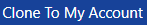
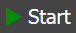
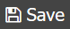

.. role:: raw-html(raw)
    :format: html

A Quick Start on Psets
======================

1. Starting up
*******************************
    Click on this link https://cde.stensal.io/2020-cs50 to go to the demo pages.
    :raw-html:` `
    You should be introduced with this page:

    .. _mainbar:
    .. image:: _static/images/main_page.png

:ref:`2<mainbar>`. Opening up the Projects Folder
*************************************************

    Scroll through the projects panel to find the pset that you want. 
    :raw-html:` `
    The panel should look like the below:

    .. image:: _static/images/Projects_part.png

    Click on the Pset that you want to use to open it.

:ref:`3<mainbar>`. Cloning the project
**************************************
    Click on the |clone_button| to clone the pset to your account so you can save changes. 
    :raw-html:` `  
    It should show you this page:

    .. _loginbar:
    .. image:: _static/images/login_page.png

    Log in anonomously or with Github/Google.
    :raw-html:` `
    This will redirect you to a similar looking page as the :ref:`page before<mainbar>`, but this time with different buttons on the top-right, shown below:

    .. _tooltip:
    .. image:: _static/images/another_tooltip.png

:ref:`4<mainbar>`. Opening Your Project
***************************************
    If done correctly, your panel on the left should look like below (we are using pset2 for this example):

    .. image:: _static/images/project_panel.png

    Click on any of the files names to open up the file. 
    The right side of your screen (:ref:`5<mainbar>`) should look something like below:

    .. image:: _static/images/code_panel.png

.. _runprog:

:ref:`6<tooltip>`. Running Your Project
***************************************
    To run your project, use the |run_button| button. 
    For people doing pset4, please see (:ref:`Additional Information<additionalinfo>`) before clicking the button. 
    :raw-html:` `
    If clicked, the IDE should pop up the compilation panel (:ref:`7<mainbar>`) before going terminal panel (:ref:`8<mainbar>`), shown below:

    .. image:: _static/images/compilation_panel.png

    In this tab, you can run your program by calling the function as you would in a normal terminal. 
    Note that if you change anything in the code, you must click the |run_button| button again.

:ref:`9<tooltip>`. Saving Your Project
**************************************
    In order to save your project, there should be a |save_button| button on where the |clone_button| should be. 
    Clicking on that button or using Ctrl+S will allow you to save the project and you can safely close the website.

-----------------------------------

.. _additionalinfo:

Additional Info. Pset4 Configs
==============================
Since pset4 requires a bmp, there are some things you have to do to set it up in the build configuration, shown below:

    .. _buildinfo:
    .. image:: _static/images/build_information.png

Changing build configuration
****************************
On the top-right tooltip, there should be a settings tool (:ref:`1<buildinfo>`). 
You can click on that to open up something called .stensal_project_configurations. 
We will be focusing on the top part of the configuration for now, shown below:

    .. _topconfig:
    .. image:: _static/images/configuration_menu.png

Changing the top parts
^^^^^^^^^^^^^^^^^^^^^^
    First, start by making a new configuration (:ref:`3<topconfig>`) and naming it (:ref:`4<topconfig>`), 
    then setting the run mode (:ref:`5<topconfig>`) to “Build and Execute”.
    Doing so will allow you to enable the bottom panel, shown below:

    .. _bottomconfig:
    .. image:: _static/images/configuration_continue.png

Changing the bottom parts
^^^^^^^^^^^^^^^^^^^^^^^^^
    For pset4, you have to change the executable (:ref:`6<bottomconfig>`) to the program you call and the program arguments (:ref:`7<bottomconfig>`) to be any arguments that you gave it. 
    :raw-html:` `
    The stdin (:ref:`8<bottomconfig>`) isn’t needed for the current pset, but it is everything that you send in after you run the arguments. 
    :raw-html:` `
    The output file (:ref:`9<bottomconfig>`) for pset4 is “out.bmp” or the bmp file you made with the program.

    After changing configurations, click on the save (:ref:`10<bottomconfig>`) button **as well as** the |save_button| button on the top left.
    You can then switch the configurations to your configuration (:ref:`2<buildinfo>`) and continue the tutorial with the :ref:`“Running the Program”<runprog>` step.

