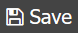
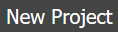
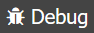
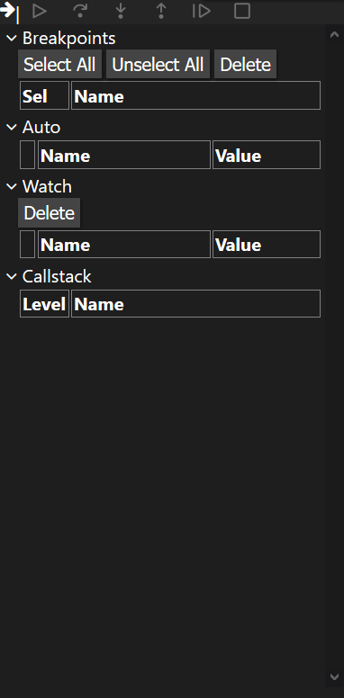
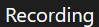

.. role:: raw-html(raw)
    :format: html

.. |clone_button| image:: _static/images/clone_button.png
    :height: 16
    :align: bottom

.. |run_button| image:: _static/images/run_button.png
    :height: 16
    :align: bottom

Quick Steps on How to Use CEE Studio
====================================

-------------------------------------------

.. _createproject:

Create a New C Project
**********************

1. Click |new_project| to open a new project form.
:raw-html:` `
There will be a form/box that appears in the middle of the page like this:

    .. image:: _static/usage_images/new-project-form.png

2. Fill in the field named "Project Name" with any name you want.

3. Select "a C main template" for the C template.

4. Click "Save".

-------------------------------------

Running Code With Segfault Protection
*************************************

1. Create a :ref:`new project<createproject>`, or click on a project in the bottom right panel, similar to the one shown below:

    .. image:: _static/usage_images/projects_menu.png

2. Click |run_button| to build and start the execution.

3. The bottom part of the screen should look like the one shown below. You can use it to run your programs.

    .. image:: _static/images/terminal_panel.png

--------------------------------------

Debugging Code
**************

1. Create a :ref:`new project<createproject>`, or click on a project in the bottom right panel, similar to the one shown below:

    .. image:: _static/usage_images/projects_menu.png

2. Click on the |debug_button| button to build and start a debugging section.

3. An menu will appear to the right of the screen that should look like the one shown below. You can use it to debug your programs.

    .. image:: _static/images/debug_panel.png

---------------------------------------

Recording Code Execution
************************

1. Create a :ref:`new project<createproject>`, or click on a project in the bottom right panel, similar to the one shown below:

    .. image:: _static/usage_images/projects_menu.png

2. Select your configuration to to be "build+run" like so: |build_run_select|

    **Note**: If your code takes command line arguments or reads from stdin, please also click on the |configuration_button| button right next to the "build+run".
    :raw-html:` `
    :raw-html:` `
    This will open up a form that will allow you to update the program arguments (2) and stdin fields (3) configuration on the bottom. 
    :raw-html:` ` Do no forget to hit the save (4) button **as well as** the |save_button| button afterwards.
    You can also change the executable (1) as shown below:

    .. image:: _static/usage_images/configuration_continue_usage.png

3. Click the |record_button| button to build, run, and execute your program.

4. You should see the |record_tab| tab, as shown below:

    .. image:: _static/images/record_panel.png